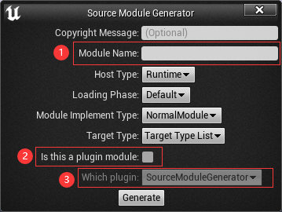
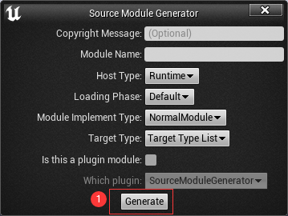

[English version README file](../../README.md)

# Source Module Generator  

## 介绍
Source Module Generator 是一个支持方便添加模块到游戏项目或插件里的UE4插件。  

## 特性  
- 交互界面对话框。  
- 生成新的游戏项目模块或插件模块。  
- 生成新模块之后可以实时加载新建的模块。  

## 安装
- ### 从源码上安装
  1. 导航到你需要安装该插件的项目的插件文件夹里。  
    `cd <游戏项目文件夹>/Plugins`  
    如果游戏项目文件夹里面没有`Plugins`文件夹，请手动创建该文件夹并命名为`Plugins`。  
  2. 从Github上克隆源码。  
    `git clone https://github.com/hy741oo/SourceModuleGenerator.git`  
  3. 以UE4编辑器模式启动项目，以编译构建该插件。  
- ### 从二进制文件上安装  
  1. 从发行包里下载对应的压缩包。  
  2. 将压缩包的内容解压到插件文件夹内，如果插件文件夹不存在的话请先创建该文件夹。  
  3. 启动游戏项目以使用该插件。  

## 使用方法
-  打开交互式界面对话框  
    
-  输入必要的信息  
    
  1. Module Name: 要创建的模块的名字。
  2. Is this a plugin module: 如果该勾选框未被选中的话，新模块会被创建在游戏项目里面，否则会被创建在下面选项指示的插件里面。
  3. Which plugin: 如果步骤2.的勾选框被选中的话，新模块会被创建在该下拉框所示的插件里面。  
-  生成模块  
    
  1. Generate: 点击该按钮之后插件就会开始生成新模块。
