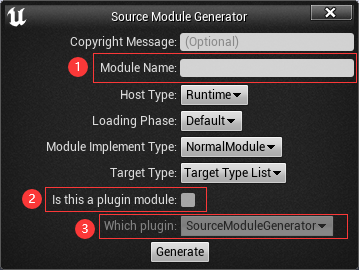

# Source Module Generator

## Intro
Source Module Generator is a Unreal Engine 4 plugin that supporting a simple way to create new module in project or plugin.

## Features

- Generate new project module.
- Generate new plugin module. 

## Usage

-  Open interactive dialog

-  Enter Necessary Message

  1. Module Name: What module name do you want for new module will generated.
  2. Is this a plugin module: If this box does not check, new module will be added into project, otherwise will be added into plugin that selected by following option.
  3. Which plugin: If 2. box has been checked, new module will be added into plugin that selected by this option.

-  Generate Module

  1. Generate: The plugin will generate new module after clicked this button.
